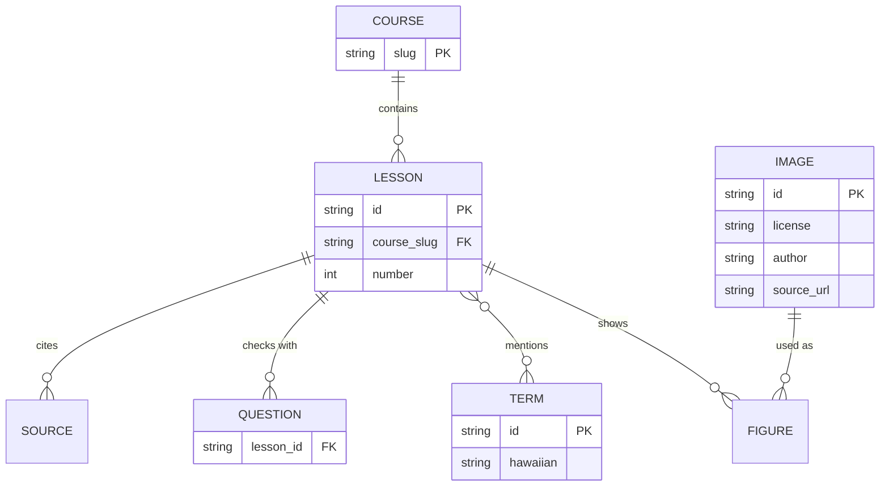
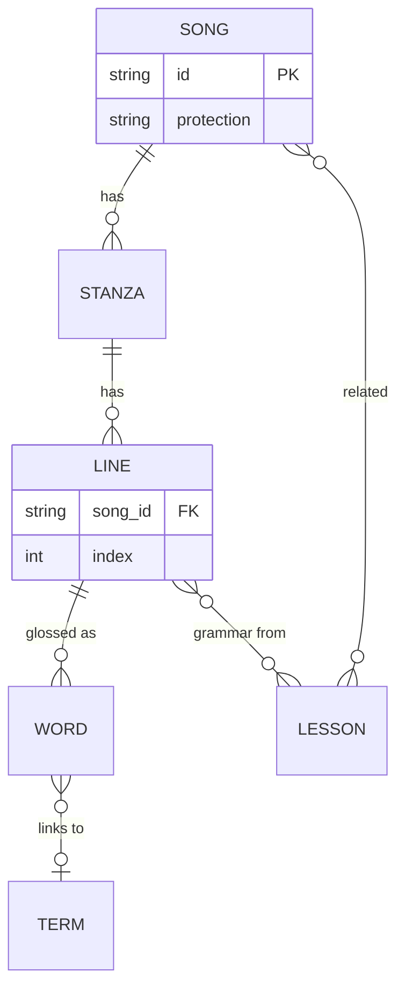

# Aʻo Hawaiʻi — 設計

- 日付: 2026-09-18
- 状態: 公開済み（2026-09-18、33レッスン）。https://iiiitiiitiiti.github.io/ao-hawaii/
- 判断の記録: [decisions/](decisions/)、資料ノート: [research/](research/)

## 結論

- **フラ実践者（18年）が自分用に使う、講座形式のハワイ総合学習サイト**。6講座（地理・生態系・神話・歴史・フラ・ハワイ語）を各5〜6レッスン、計33レッスンで公開する
- スタックは既存リポ（instrument-lessons / flashcards）と同じ **Vite + React 19 + TypeScript + MDX + Vitest → GitHub Pages**。本文は MDX、講座とレッスンの目次は TS のデータ
- 画像は **Wikimedia Commons から取得スクリプト経由でのみ**取り込む。ライセンス・作者・出典 URL を API から機械的に記録し、ビルド時テストが「記録なし・許可外ライセンス・実体なし」を落とす

## 何を作るか

| 項目 | 内容 |
|---|---|
| 作るもの | 講座（コース）→ レッスンの2階層で読む学習サイト。用語集・年表・画像出典の一覧ページを持つ |
| 使う人 | ユーザー本人（フラ歴18年、歌詞は読める、文法を体系的に学びたい） |
| 成功条件 | 各レッスンが「学習目標 → 本文（図版つき）→ 用語 → 確認問題 → 出典」で読み通せ、ハワイ語の記述が一次資料（Pukui-Elbert 辞書、Elbert & Pukui *Hawaiian Grammar*、ulukau.org）と食い違わない |

ユーザーの回答（2026-09-18 深夜）: 重心はフラ実践＋教養の両立。ハワイ語は文法まで。GitHub Pages 公開。朝5時まで作り続ける。

## 講座構成

| # | 講座（ハワイ語名） | レッスン |
|---|---|---|
| 1 | ʻĀina — 地理と自然環境 | 諸島の成り立ち／島ごとの地形と気候／アフプアア／火山とペレの地質／海／wahi pana と風・雨の名 |
| 2 | Nā Mea Ola — 生態系 | 到達と固有種／鳥類の危機／植物（カヌー植物・在来種・フラの植物）／海の生きもの／外来種と保全 |
| 3 | Moʻolelo — 神話と伝承 | クムリポ／四大神とマカヒキ／ペレとヒイアカ／ラカとカポ／マウイと英雄譚・ʻōlelo noʻeau |
| 4 | Mōʻaukala — 歴史 | 到達と古代社会／カメハメハ・ʻAi Noa・宣教師／王国の時代／転覆と併合／準州から州へ、復興と主権運動 |
| 5 | Hula — フラ | 起源と歴史／カヒコとアウアナ／用語／メレの種類と kaona／ハーラウ・クムフラ・ʻūniki／現在の潮流 |
| 6 | ʻŌlelo Hawaiʻi — ハワイ語 | 音と表記／名詞・冠詞・所有（a/o）／名詞文と場所文／動詞文とアスペクト／方向詞・前置詞・指示詞／疑問・否定・関係節と辞書の引き方／歌の言葉（小辞・重複・歌だけの形。2026-09-18 追加） |

講座の順は「読む順」ではない。ハワイ語の表記と発音の約束だけは全講座の前提になるため、`/notation`（表記について）を独立ページとして置き、トップの先頭から案内する。講座6の1本目はその深掘り。

執筆は講座順ではなく**講座横断のラウンドロビン**（各講座の1本目→2本目→…）で進め、どこで止まっても全講座が先頭から連続して読める状態を保つ。本文は1本1,500〜2,500字。

レッスン1本の型（参考サイト aloha-program.com の講座詳細ページの型を骨格の参考にした）:
所要時間・リード文 → 学習目標 → 本文（`<Photo>` 図版に出典帯） → `<Terms>` 用語ボックス → `<Quiz>` 確認問題（3問） → `<Sources>` 出典。

## データモデル

- COURSE / LESSON の目次: `src/content/courses.ts`（id・番号・題・到達点・所要分）
- LESSON 本文: `content/<course>/lesson-NN.mdx`（FIGURE・QUESTION・SOURCE は本文中のコンポーネント）
- IMAGE: `src/content/images.json`（取得スクリプトが書く。手で書かない）＋ `public/images/<id>.jpg`
- TERM: `src/content/glossary.ts`（用語集ページと `<Terms>` の正本）
- 進捗: localStorage（レッスン完了のみ）

## 代替案

| 案 | 却下理由 |
|---|---|
| Python で静的 HTML を生成（quiz-atlas 方式） | 確認問題・用語ポップアップ・進捗など対話要素を素の JS で書き直すことになる。React+MDX の既存資産（instrument-lessons の Lesson レイアウト・進捗ストア）を流用するほうが速く、保守も1系統で済む |
| Astro + MDX | コンテンツサイトには最適だが、既存3リポと別スタックになる。instrument-lessons DDR 002 と同じ理由で見送る |
| 画像を Commons へホットリンク | ダウンロード不要だが、Commons 側のファイル名変更で図が消える。ローカルに複製し、出典を manifest に固定する |
| 画像を手動で保存し出典を手書き | 作者・ライセンスの写し間違いが起きる。API の extmetadata から機械的に記録する |
| 1講座ずつ深く、残りは後日 | ユーザーが「全5講座を通しで」を選んだ |

## メレを読む・相互リンク（2026-09-18 追加）

- `/mele` に曲のページを置く。1曲 = 公開してよい部分（題・作者・成立・関連レッスン、`src/content/mele.ts`）＋本体（歌詞を行ごとに「ハワイ語・全語の逐語の意味・行の訳・文法メモ」）。本体は公開曲なら `content/mele/<id>.ts`、保護期間中の曲なら暗号文 `src/content/mele-locked/<id>.json`。区分と暗号化の方式は `docs/decisions/008`
- 保護曲の追加手順: 平文を Drive の `ao-hawaii-private/mele/<id>.json` に書き、`src/content/mele.ts` に `protection: "locked"` で登録して `npm run mele:lock`。検査に通らなければ暗号化しない
- 本文の「Lesson NN」は、ビルド時にそのレッスンへのリンクになる。用語ボックスの語は用語集へ、用語集の語は出てくるレッスン・公開曲へリンクする（`docs/decisions/009`）

## やらないこと（Non-goals）

- 音声（ハワイ語の発音音源）。信頼できる自由ライセンスの音源が揃わないため、音節分解とカタカナ近似の併記に留める
- 検定・採点の永続化。確認問題はその場の答え合わせだけ
- 検索。用語集の絞り込みで代替する
- PWA/オフライン。instrument-lessons と違い練習中に開く前提がないため入れない（後から足せる）
- カタカナによる発音近似。18年の実践者には不要で、w の [v] や二重母音を誤って固定する。音節分割と強勢規則で足りる
- 出典の一覧ページ。出典は各レッスン末尾の `<Sources>` に置き、横断一覧は作らない（画像だけ `/credits` に全件を出す）

## 画像の取り込み規約

- 取得元は Wikimedia Commons のみ。`npm run image -- "File:xxx.jpg" <id>` が 1280px 版を保存し、`images.json` に `title / author / license / licenseUrl / sourceUrl / credit / fetchedAt / revision / subjectNote` を書く。拡張子は API が返す URL から決める（PNG/SVG 由来のサムネイルは PNG で返る）
- 許可するライセンス: Public domain（PD-US / PD-art / PD-old などの変種を含む）, CC0, CC BY, CC BY-SA（バージョン不問）。NC・ND は使わない
- `LicenseShortName` は `"CC BY-SA 3.0,GFDL"` のように複数が連結されて来る。カンマで分け、**1つでも許可ライセンスが含まれれば可**とする（多重ライセンスは利用者が選べる）
- 被写体側の権利（現代の彫像・壁画、人物写真の肖像権）はライセンス欄に出ない。`subjectNote` を人が書く欄として持ち、人物が主題の現代写真は公的行事（Merrie Monarch のステージ等）のものに限る
- 図版の直下に必ず出典帯を出す（作者・ライセンス・Commons へのリンク）。`/credits` に全件を一覧する
- テスト `tests/images.test.ts`: MDX が参照する id が manifest にある／manifest の全件がファイルとして存在する／ライセンスが許可リスト内

## 歌詞（mele）引用の規約

instrument-lessons DDR 004（日米両国で保護期間満了）をテキストにも適用する。

- **全文または節単位の掲載**は、作詞者全員が1967年末までに死亡し、かつ1929年より前に出版された mele に限る（伝承 oli・Kalākaua 期の作品・Liliʻuokalani 作品など）
- 保護期間中の mele は、解説に必要な**1〜2行の引用**に留め、作者名・曲名を必ず添える（日本の著作権法32条・米国 fair use の範囲）
- 引用した mele は `<Sources>` に曲名・作者・掲載元を書く
- **「メレを読む」（`/mele`）の保護期間中の曲**は例外として全文を置くが、本体（歌詞・逐語注・行訳・kaona）は暗号化し、パスワードを入れた端末でだけ読める。平文は Drive にだけ置き、git には暗号文だけを入れる。本人しか読めないことを根拠にした運用で、適法と断定するものではない（`docs/decisions/008`）

## ハワイ語表記の規約

- ʻokina は U+02BB「ʻ」、kahakō はマクロン付き母音（ā ē ī ō ū）。ASCII のアポストロフィ・スマートクォートは使わない
- 表記の正本は Pukui & Elbert, *Hawaiian Dictionary*（wehewehe.org）。地名は *Place Names of Hawaii*
- テスト `tests/orthography.test.ts`: 用語集と MDX 内の `<H>`（ハワイ語スパン）に ' ’ ‘ が混ざっていないこと
- 用語集の各エントリは `sourceUrl` と `checkedAt` を必須にする。`<Terms>` が参照する id が用語集に在ることをテストで検査する

## テストが見ないもの

テストが検査するのは文字種・参照の存在・ライセンスの形（曲データでは、語を並べると歌詞の行になること）だけで、**ハワイ語・神話・史実の正しさは一切捕まえない**。正しさは、資料ノート（出典URLつき）→ 本文執筆 → 出典の明記、という手順と、後日の読み直しで担保する。疑義が残った記述の扱いは 2026-09-18 に改めた（`docs/decisions/007`）。出典が複数あれば本サイトの判断で言い切り、1つならその出典を本文で名指しし、0なら書かない。「本サイトの調査では確認できていません」型の注記は置かない（`tests/hedging.test.ts` が禁止フレーズを検査する）。

## 実装ステップ

1. 足場（package.json・vite・CI・ルーティング・レイアウト・トークン）→ `npm run build` が通る
2. 画像取得スクリプト＋manifest＋テスト → 1枚取り込んでテストが通る
3. 講座・レッスンの目次データ＋用語集の骨格 → コース一覧が表示される
4. 資料調査（講座ごとに並列）→ 出典 URL つきのノート
5. レッスン執筆（27本）＋図版取り込み → 各レッスンが描画テストを通る
6. 用語集・年表・出典一覧ページ
7. lint・test・build → GitHub リポ作成・push → Pages 公開 → URL 確認

## プランレビュー

- レビュアー: Claude Opus（fable-advisor サブエージェント）、2026-09-18
- 結論: 進めてよい。最大のリスクは「テストは形しか見ず、内容の正しさを捕まえない状態で一晩に27本が公開面へ出ること」
- 反映した指摘
  - 歴史講座が無い → 講座4「Mōʻaukala — 歴史」を5本追加（計33本）
  - wahi pana・風雨の名が無い → 講座1に6本目を追加
  - 表記・発音が最後にある → `/notation` を独立ページとして先頭に置く
  - 歌詞の権利規約が無い → 「歌詞（mele）引用の規約」を追加
  - extmetadata の穴（多重ライセンス・PD 変種・被写体の権利）→ 判定規則と `subjectNote`・`revision`・`fetchedAt` を追加
  - 拡張子の決め打ち → API の URL から決める
  - 用語の担保 → 用語集に `sourceUrl`/`checkedAt` 必須、`<Terms>` の参照テスト
  - 講座順に書くと最後の講座が空になる → ラウンドロビンで執筆
  - カタカナ近似 → やめる（Non-goals へ）
  - テストが内容を見ないこと → 「テストが見ないもの」節に明記
- 見送った指摘
  - 出典・確認問題を MDX の外の構造化データへ → 出典の横断一覧を作らないことにしたため、MDX 内に置くほうが執筆が速く、レッスンごとに完結する。確認問題も同様。将来一覧が要るなら、その時に移す
